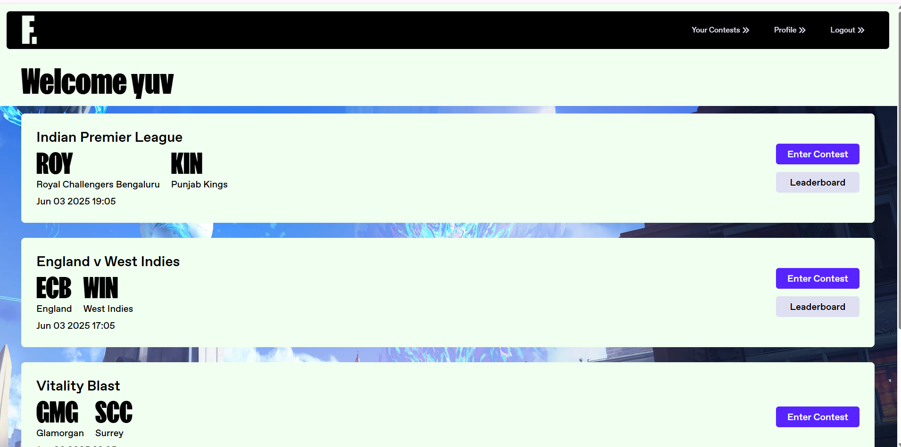
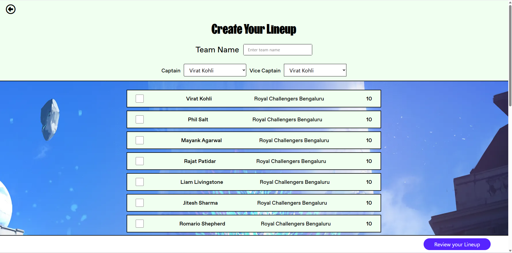
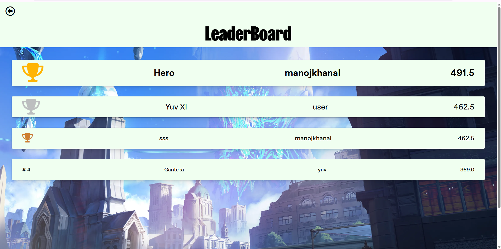

# 🎮 Fantasy Flick 🏏  
*A Fantasy Sports Web App built with Flask + TailwindCSS*

 

## 🔥 Overview

**Fantasy Flick** is a full-stack fantasy cricket web app where users can:

- Select live matches  
- Create a fantasy team with real players  
- Compete with others based on player performance  
- View rankings on a dynamic leaderboard  

Everything is styled with **TailwindCSS**, powered by a **Flask**, and the data comes from a  **Cricket API** to keep the experience authentic.

🟢 **Live Site:** [https://fantasyflick-05af.onrender.com/](https://fantasyflick-05af.onrender.com/)  
🎨 **UI Inspired by:** [Zentry](https://zentry.com/)  
🚀 **Hosted on:** [Render](https://render.com)

---

## 🚀 Key Features

✅ User Signup and Login  
✅ Match selection by date  
✅ Real-time player stats via Cricket API  
✅ Fantasy team builder with role-based selection rules  
✅ Auto-calculated points based on real match data  
✅ Leaderboard generation  
✅ Fully responsive UI for all devices  

---

## 📷 Screenshots

> *Here’s a look at how Fantasy Flick works:*

**🏠 Homepage**  

**🔐 Signup Page**  

**🔑 Login Page**  

**🧢 Team Selection**  

**📊 Leaderboard**  

---

## 🎥 Demo

Check out a walkthrough of the app here:  

---

## 🧠 Tech Stack

- **Backend:** Flask, Python  
- **Frontend:** TailwindCSS, HTML, Jinja2  
- **Database:** PstgresSQL  
- **APIs:** Cricket API  
- **Hosting:** Render  

---

## 📦 Phase 1 (Current Status)

This is the **first working version** of Fantasy Flick. It focuses on getting the core user journey right — from signing up to creating a team and checking points on the leaderboard.  

Instead of real-time syncing or background automation, currently I have manually select a date to view available matches and create teams. Player stats are pulled using a **live Cricket API**, but calculations and updates happen on user-triggered events (like submitting a team).

In short, In Phase 1 it was all about building a **solid game loop**: match → team → points → rank. It’s clean, responsive, and fully functional.

---

## 🛠 Phase 2 (Coming Soon)

What’s next? Here’s what I plan to add:

- 🔁 Real-time match tracking and score sync  
- ⏱ Background tasks with Celery (auto-updating points and leaderboards)  
- 💰 Prize pools and wallet integration  
- 📲 Push notifications for match updates  
- 🧾 More contest types (Mega, Mini, H2H)  
- 🌍 Multi-match support with advanced analytics

---

## 👨‍💻 Author

**Yuv**  
- 🌐 [GitHub](https://github.com/YuvBhatt-YB)  
- 💼 [LinkedIn](https://www.linkedin.com/in/yuv-bhatt/)  

---

## 📌 License

This project is for educational and portfolio purposes only.
